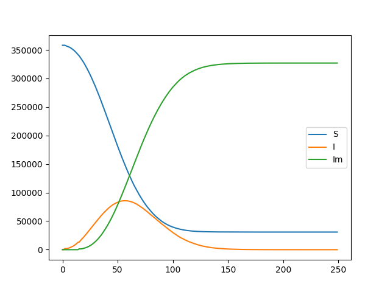
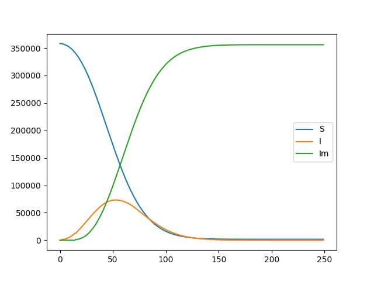
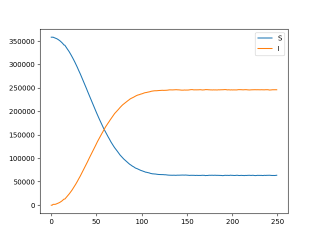

# Pestilence
Basic Epidemic modeler using cellular automaton in Java 

#### The Algorithim
Pestilence uses a 2 dimensional lattice to simulate epidemic scenarios. Each cell's state is either Susceptible, Incubating, Infectious, Dead, or Immune. 
The lattice is updated by looping over each incubating and infectious cell. If the cell is infectious, and its timeInfected is equal to the incubation period of the Pathogen object, it moves on to the infectious state and its timeInfected reset. Otherwise, its timeInfected increments. If the cell is infectious, a random neighbour is chosen and has a probability of being infected (Susceptible -> Incubating), this proability is the R0 parameter of the Pathogen object. And its timeInfected incremented.

#### Pathogen Object 
The Pathogen object stores data pertaining to the simulated Pathogen:
1. immunity_gain: The probability that, upon reaching the end of their infectious period, an infectious cell will transfer to the Immune state
2.  R0: The probability that an infection is successfully transmitted (Susceptible -> Infected)
3. fatality: The probability that, upon reaching the end of their infectious period, an infectious cell will transfer to the Dead state
4. incubation: Time in frames/ iterations that a cell is Incubating
5. infectious: Time in frames/ iterations that a cell is Infectious

#### Example run with an SIRS model:
parameters:
1. R0 = 0.45
2. fatality = 0.0
3. incubation = 2
4. infectious = 12
5. immunity_gain = 0.75
6. infection seed probability = 0.0005 (probability that a cell is initialized as infected at epoch 0)

#### Example run with an SIR model:
parameters:
1. R0 = 0.45
2. fatality = 0.0
3. incubation = 2
4. infectious = 12
5. immunity_gain = 1.0
6. infection seed probability = 0.0005 (probability that a cell is initialized as infected at epoch 0)

#### Example run with an SIS model:
parameters:
1. R0 = 0.45
2. fatality = 0.0
3. incubation = 2
4. infectious = 12
5. immunity_gain = 0.0
6. infection seed probability = 0.0005 (probability that a cell is initialized as infected at epoch 0)

